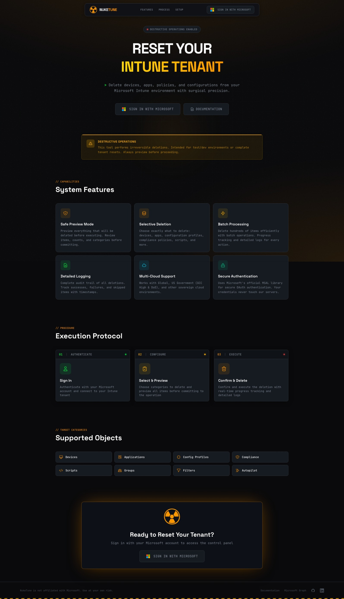
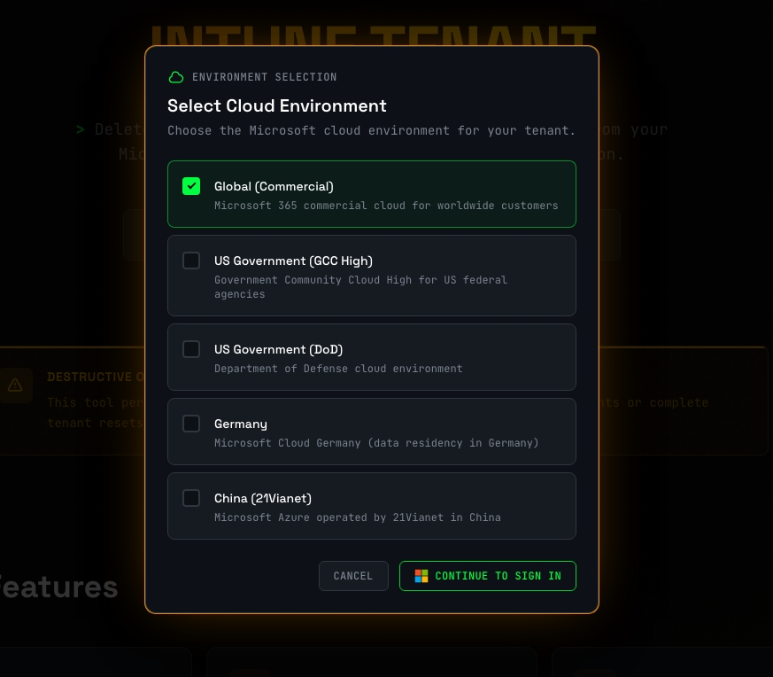
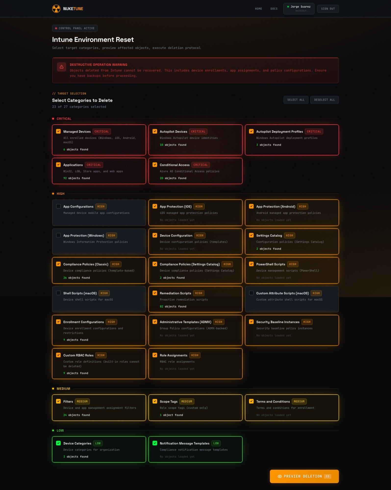
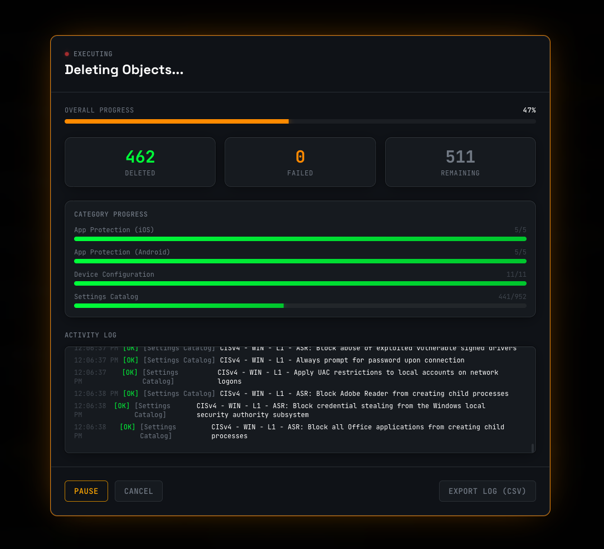

<p align="center">
  
</p>

# NukeTune


Bulk deletion tool for Microsoft Intune environments. Reset your tenant by removing devices, apps, policies, and configurations in one operation.

**Live**: [nuketune.com](https://nuketune.com)

## Screenshots

<p align="center">
  
</p>

<p align="center">
  
</p>

<p align="center">
  
</p>

<p align="center">
  
</p>

## Features

- Delete objects across 25+ Intune categories
- Multi-cloud support (Commercial, GCC High, DoD, Germany, China)
- Preview before deletion
- Progress tracking and deletion logs
- No app registration required (multitenant)

## Supported Categories

| Critical | High | Medium/Low |
|----------|------|------------|
| Managed Devices | Device Configuration | Filters |
| Autopilot Devices | Settings Catalog | Scope Tags |
| Autopilot Profiles | Compliance Policies | Device Categories |
| Applications | PowerShell Scripts | Terms and Conditions |
| Conditional Access | Shell Scripts (macOS) | Notification Templates |
| | Remediation Scripts | |
| | App Protection Policies | |
| | Administrative Templates | |
| | Security Baselines | |
| | RBAC Roles & Assignments | |

## Usage

1. Go to [nuketune.com](https://nuketune.com)
2. Click **Sign in with Microsoft**
3. Select your cloud environment
4. Authenticate and grant consent (if prompted)
5. Select categories to delete
6. Click **Preview Deletion** to review objects
7. Type `DELETE` to confirm

## Requirements

- Intune Administrator or Global Administrator role
- Admin consent for required permissions (prompted on first sign-in)

## Required Permissions

| Permission | Purpose |
|------------|---------|
| DeviceManagementManagedDevices.ReadWrite.All | Devices |
| DeviceManagementServiceConfig.ReadWrite.All | Autopilot, enrollment |
| DeviceManagementConfiguration.ReadWrite.All | Policies, scripts |
| DeviceManagementApps.ReadWrite.All | Applications |
| DeviceManagementRBAC.ReadWrite.All | Roles |
| Policy.ReadWrite.ConditionalAccess | Conditional Access |
| Policy.Read.All | Policy reading |

## Local Development

```bash
# Install dependencies
npm install

# Set environment variables
cp .env.example .env
# Edit .env with your values

# Run dev server
npm run dev
```

Runs on `http://localhost:4000`

## Environment Variables

```
NEXT_PUBLIC_MSAL_CLIENT_ID=your-app-id
NEXT_PUBLIC_MSAL_AUTHORITY=https://login.microsoftonline.com/common
NEXT_PUBLIC_MSAL_REDIRECT_URI=http://localhost:4000
NEXT_PUBLIC_CLOUD_ENVIRONMENT=global
```

## Warning

**This tool performs irreversible deletions.** Only use on test/dev tenants unless you fully understand the consequences. Always back up important configurations before proceeding.

## License

MIT
